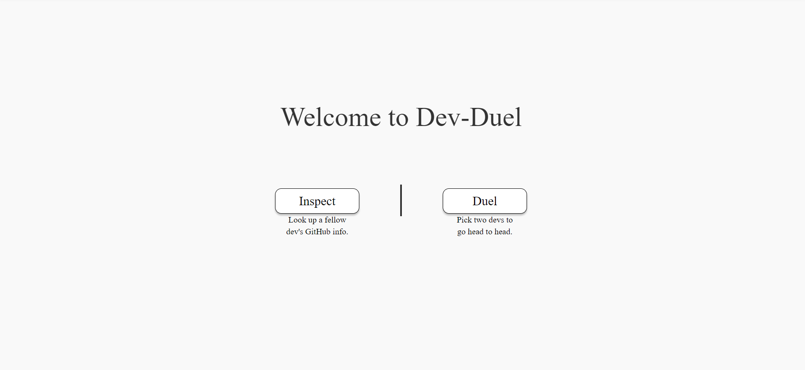
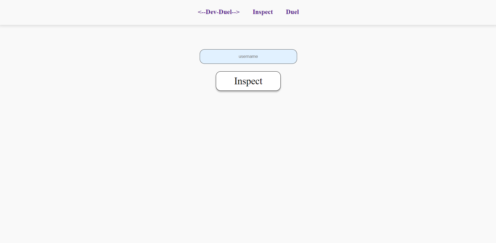
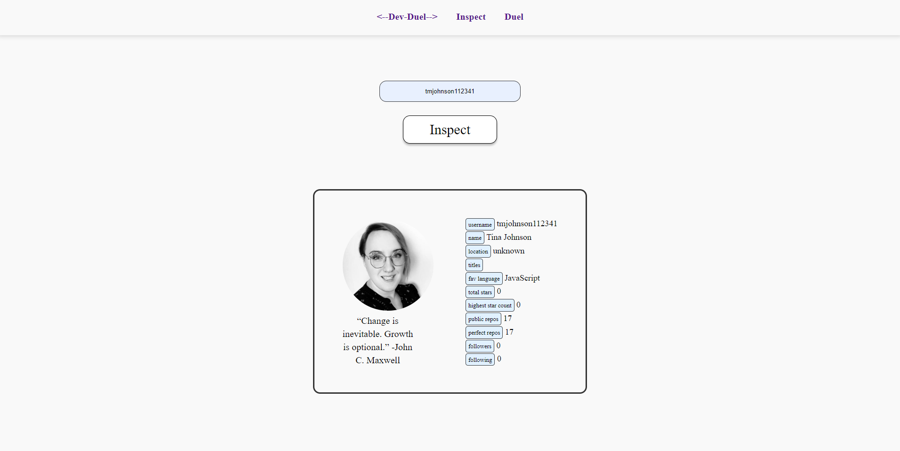
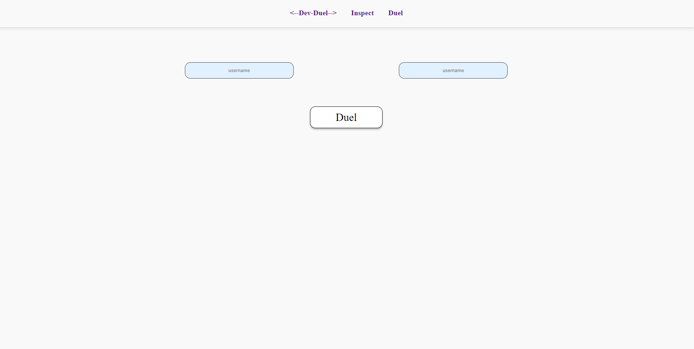
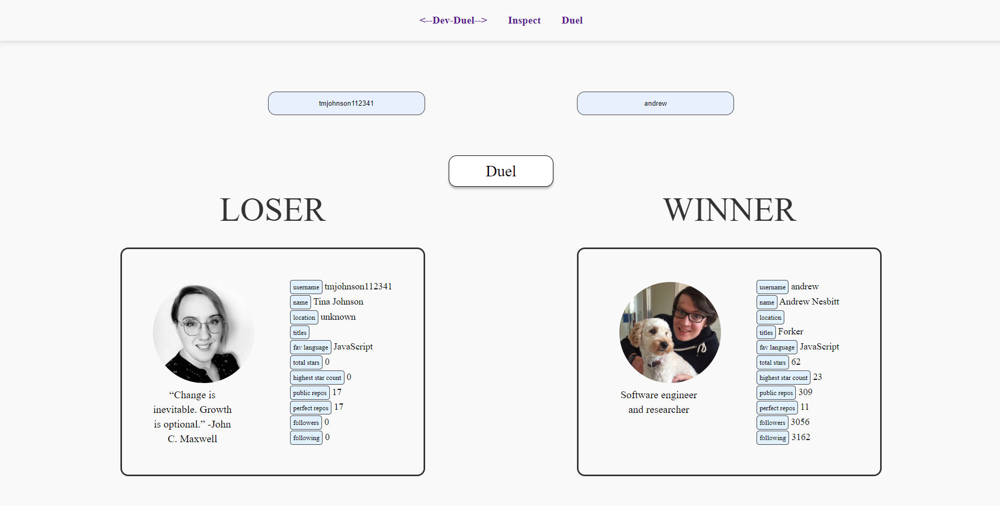

# Dev-Duel
This application is a fun game where users can navigate to the inspect page and assess a developer from GitHub's api using their username. They can then navigate to the duel page to battle 2 developers against each other. The developer with the hightest star count WINS!
Project Prompt:

## Technology

- Built with React.js, JSX, HTML, CSS, Expressjs, Node.js, and Git 

## Screenshots 
### Home:

The Homepage has the following features:

- 2 buttons that allow you to navigate to either the inspect page or the duel page.

### Inspect Page:

- Has a field where you can type in a GitHub username and a button where you can submit to pull up the users data.

### Inspect Card:

- Once the button is pressed it pulls up the users information card.
- Displays information from GitHub's api.

### Duel Page:

- Navigating to the Duel page shows two input fields where you can input two different GitHub usernames.
- Pressing the button with duel the users.

### Duel Page Cards:

- Once the button is pressed it will display both users GitHub information cards.
- The winner is the one with the most stars.
- The winning status is displayed above the user cards

